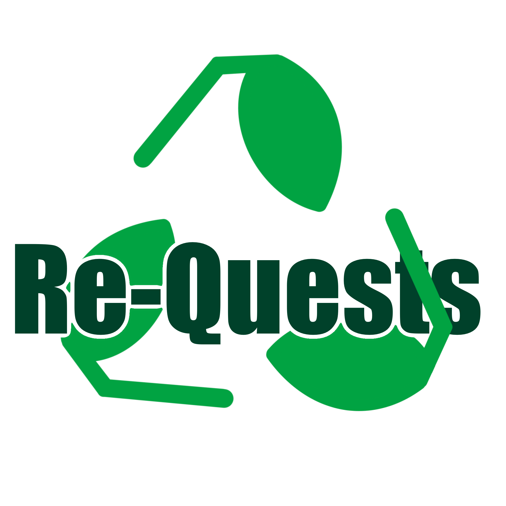

<h1 align="center"><b>Re-quests</b></h1>
<h2 align="center">Quests about recycling</h2>

  

 

<h2 align="center"><b><a href="https://re-quests.herokuapp.com">Visit the website here</a></b></h2>

---

 

## **Our Idea**

  If you ask someone if he is eco-friendly, and what does he do to protect environment you are likely to hear somhing like <i>'yeah I turn off the water when brushing my teath'</i> (but let's be honest, who does not?), or <i>'I use shower instead of bath'</i> (just like if he thought the water he doesn't use somehow magicaly teleports to people in need).

  Our app can help You <b>be more eco</b> by giving You interesting <b>quests about recycling</b> and suggestions how to <b>reuse what one could call garbage.</b> 

 
  
## What we do:

 - Reasearch cool ways of helping nature related to recycling
 - Provide those to you in form of appealing quests
 - Show you what you have accomplished so far so that you can actually see progress in becoming <b>Earth's friend</b> and brag to Your friends :)

 

---

## Our technologies:

<b align="center">
  
  
  
  
  

  
  
  
  
</b>

 

- **Website** coded in **Vue.js**
- All the **design** before coding website was done using **Figma**
- **API** coded in **C#**
- For data storage we use **PostgreSQL** database
- Everything is hosted inside **Docker** containers

 

---

## Hello from us
 

| Contributor | Role |
| :---: | --- |
|  | UI Designer, Graphics designer |
|  | Back-End Dev |
|  | Front-End Dev, Part UI Designer |

  
